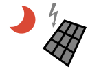

# Photovoltaiksymbole / Photovoltaics Icons

Wettersymbole siehe / weather symbols see [weathericons](https://github.com/roe-dl/weathericons)

## Inhalt / Contents

* [Symbole / symbols and icons](#symbole--symbols-and-icons)
  * [Photovoltaik-Symbole / photovoltaics icons](#photovoltaik-symbole--photovoltaics-icons)
  * [Photovoltaik-Symbole, gefüllt / photovoltaics icons, filled](#photovoltaik-symbole-gefüllt--photovoltaics-icons-filled)
  * [Feuerwehrzeichen Photovoltaik DIN 4066 / Fire safety signs photovoltaics DIN 4066](#feuerwehrzeichen-photovoltaik-din-4066--fire-safety-signs-photovoltaics-din-4066)
* [Lizenz und Nutzungsrechte](#lizenz-und-nutzungsrechte)
* [License and Usage](#license-and-usage)
* [Danksagungen / Credits](#danksagungen--credits)
* [Links](#links)

## Symbole / Icons

### Photovoltaik-Symbole / photovoltaics icons

Photovoltaik / photovoltaics | heiter/fair | bedeckt / overcast | Nacht/night
-----------------------------|---------------------|---------------------|------------------------
 |  |  |  

Solarpanel/pv panel | Batterie/accumulator
-----------------------------|---------------------
 | 

----------------------------------------------------------------------------

### Photovoltaik-Symbole, gefüllt / photovoltaics icons, filled

Photovoltaik / photovoltaics | heiter/fair | bedeckt / overcast | Nacht/night
-----------------------------|---------------------|---------------------|--------------------
 |  |  | 

Solarpanel/pv panel | Batterie/accumulator
-----------------------------|---------------------
 | 

----------------------------------------------------------------------------

### Feuerwehrzeichen Photovoltaik DIN 4066 / Fire safety signs photovoltaics DIN 4066

Feuerwehrzeichen geben wichtige Informationen für die Einsatzkräfte, hier
über das Vorhandensein einer Photovoltaikanlage. Wenn Sie die Symbole in
einer anderen Größe benötigen, rufen Sie das Script `bin/firesafety.py` auf.

Fire safety signs provide important information to the fire brigade, in
this case about the existance of photovoltaics. If you need the symbols
in another size, please, call the script `bin/firesafety`.

ohne Batterie / without battery | mit Batterie / with battery | Notstrom / emergency power | Schwarzstartfähigkeit / black start
--------------------------------|-----------------------------|----------------------------|------------------------------------
 |  |  | 

----------------------------------------------------------------------------

## Lizenz und Nutzungsrechte

Die Symbole können im nichtkommerziellen Bereich frei verwendet werden.
Die Werke müssen auch nicht unter die GPL gestellt werden (Fonts
Exclusion). Bearbeitungen der Symbole selbst unterliegen dagegen
der GPL.

## License and Usage

In non-commercial domain the symbols can be freely used. What you create
using these symbols is not required to be subject to the GPL (fonts
exclusion). However, the GPL applies to editing the symbols themselves.

## Danksagungen / Credits

* Pat O'Brien for the [Belchertown skin icons](https://github.com/poblabs/weewx-belchertown)

## Links

* [Wettersymbole / weather icons](https://github.com/roe-dl/weathericons)
* [PV Wöllsdorf](https://www.woellsdorf-wetter.de/photovoltaics/)
* [WeeWX](https://weewx.com)
* [WeeWX-Erweiterung PV / WeeWX extension PV](https://github.com/roe-dl/weewx-photovoltaics)
* Deutscher Feuerwehrverband: [Einsatz an Photovoltaikanlagen](https://www.feuerwehrverband.de/app/uploads/2020/05/BSW_Feuerwehrbroschuere_2010.pdf)
