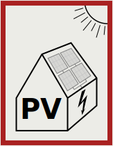
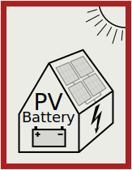
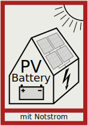
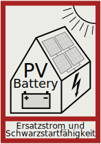

# Feuerwehrzeichen / Fire safety signs

## Inhalt dieses Verzeichnisses / Contents of this directory

Das SVG-Format der Dateien ermöglicht eine problemlose Skalierung 
(Vergrößerung, Verkleinerung) und Anpassung sowie Erweiterung um 
zusätzliche Icons.

Because of the Scalable Vector Format (SVG) of these files, they can 
easily be scaled and edited, and also, additional icons can be derived 
from them.

Feuerwehrzeichen PV ohne Batterie / fire safety sign PV withour battery | Feuerwehrzeichen PV mit Batterie / fire safety sign PV with battery | Feuerwehrzeichen PV mit Notstrom / fire safety sign PV with emergency power | Feuerwehrzeichen PV mit Schwarzstartfähigkeit / fire safety sign PV with black start capability
------------------------------------------------------------------------|---------------------------------------------------------------------|-----------------------------------------------------------------------------|------------------------------------------------------------------------------------------------
 |  |  | 

## Lizenz und Nutzungsrechte

Die Icons können im nichtkommerziellen Bereich frei verwendet werden.
Die Werke, in denen sie verwendet werden, müssen auch nicht unter die 
GPL gestellt werden (Fonts Exclusion). Bearbeitungen der Icons selbst 
unterliegen dagegen der GPL.

## License and Usage

In non-commercial domain the icons can be freely used. What you create
using these icons is not required to be subject to the GPL (fonts
exclusion). However, the GPL applies to editing the icons themselves.
